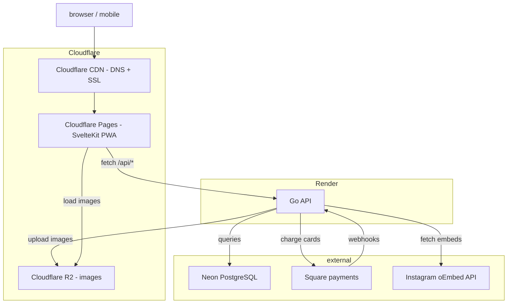
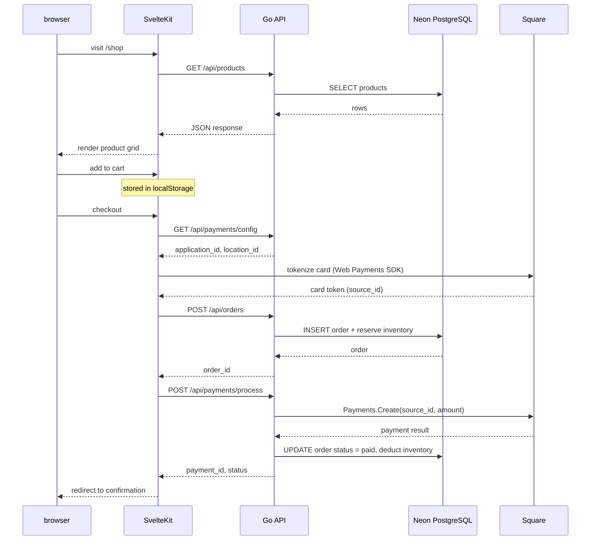
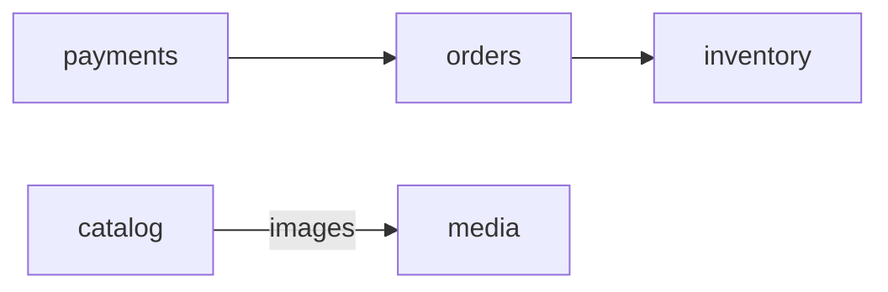
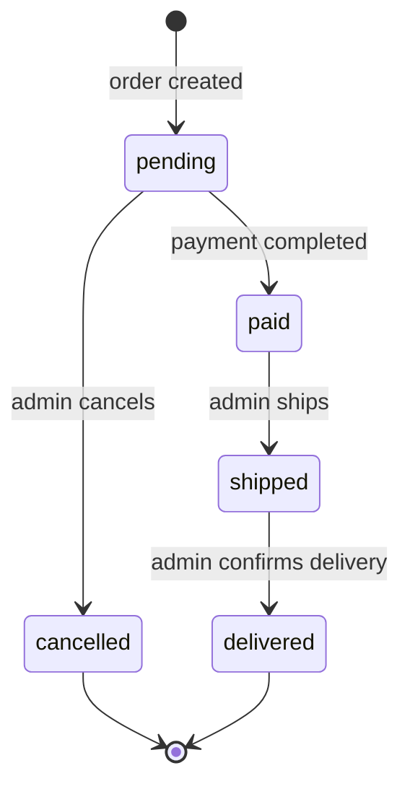
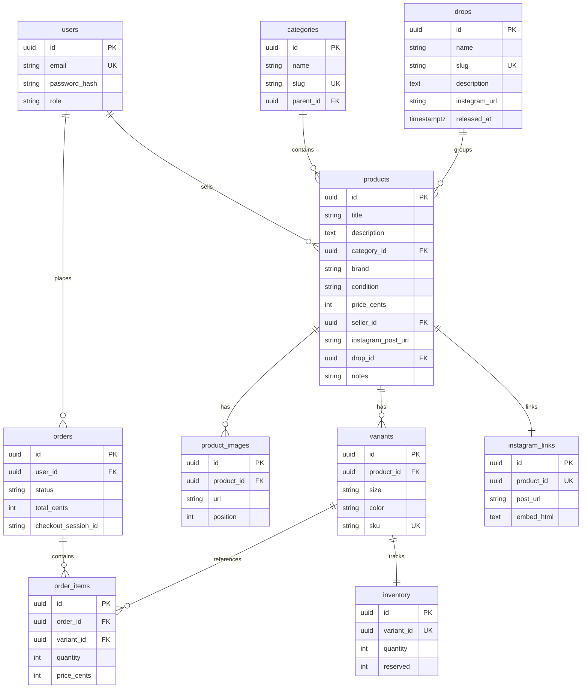

# architecture

## system overview



## request flow



## backend

the api is a single Go binary with domain-separated packages under `internal/`.

### domain modules

| module | responsibility | depends on |
|--------|---------------|------------|
| `auth` | JWT registration and login | - |
| `catalog` | products, categories, variants | - |
| `inventory` | stock tracking per variant (reserve, deduct, release) | - |
| `orders` | order lifecycle management | `inventory` |
| `payments` | Square card charges and webhook processing | `orders` |
| `instagram` | oEmbed link management per product | - |
| `media` | image upload and serving via R2 | - |

### module dependencies



all other modules are independent.

### order state machine



inventory is reserved on order creation and deducted on payment. if an order is cancelled, reserved inventory is released.

## layering

each module follows the same pattern:

```
handler.go      HTTP layer - routing, input validation, response formatting
    |
service.go      business logic - depends on repository interface
    |
repository.go   data access - SQL queries via pgx
    |
model.go        domain types
```

dependencies flow inward: handler -> service -> repository. services depend on interfaces, not concrete types. all wiring happens in `cmd/server/main.go` via constructor injection.

### middleware chain

requests pass through middleware in this order:

```
request
  -> RequestID        generate unique id, add to context + response header
  -> Logger           structured slog (method, path, status, duration, ip, request_id)
  -> Recoverer        catch panics, return 500
  -> RealIP           extract client ip from X-Forwarded-For
  -> CORS             environment-aware (wildcard in dev, allowlist in prod)
  -> SecureHeaders    X-Content-Type-Options, X-Frame-Options, Referrer-Policy
  -> MaxBodySize      10 MB limit
  -> RequireJSON      415 on non-json POST/PUT/PATCH (except multipart)
  -> handler
```

auth-protected routes add:

```
  -> Auth             validate JWT Bearer token
  -> RequireRole      check role claim (admin, seller)
```

rate-limited routes (auth, payments) add:

```
  -> RateLimit        per-ip token bucket with Retry-After header
```

### shared packages

| package | purpose |
|---------|---------|
| `pkg/config` | loads env vars, validates required ones, fails fast on startup |
| `pkg/middleware` | request ID, CORS, auth, rate limiting, logging, security headers, content-type validation |
| `pkg/httputil` | JSON response helpers, error formatting (5xx errors are sanitized, logged server-side) |

## frontend

SvelteKit 5 with Svelte 5 runes (`$state`, `$derived`, `$effect`, `$props`). deployed as a PWA to Cloudflare Pages via `adapter-cloudflare`.

### key files

| file | purpose |
|------|---------|
| `src/lib/api.ts` | typed API client for all backend endpoints |
| `src/lib/stores/cart.svelte.ts` | cart state with localStorage persistence |
| `src/lib/stores/toast.svelte.ts` | toast notification store |
| `src/lib/components/` | reusable UI (ProductCard, Navbar, Footer, Toast, etc.) |
| `src/routes/` | pages (home, shop, product detail, cart, checkout, confirmation, about) |
| `src/app.css` | Tailwind v4 with custom theme tokens |

### client-side features

- search, category filter, and price sort on shop page (all via `$derived.by()`)
- "you might also like" recommendations on product detail pages
- toast notifications on add-to-cart
- optimistic cart updates (localStorage, no server round-trip)
- PWA installable on mobile home screens

## database schema



## key decisions

| decision | rationale |
|----------|-----------|
| sqlc over ORM | SQL is the source of truth, type-safe Go code generated from queries, zero runtime overhead |
| Square over Stripe | unifies in-person and online sales under one provider, single dashboard for reporting |
| Neon over self-hosted postgres | managed, serverless, free tier with automated backups |
| Cloudflare R2 over S3 | no egress fees, S3-compatible API, same ecosystem as Pages |
| Render over Cloud Run/Fly.io | simplest free deployment - connect repo and go, no GCP/Fly complexity |
| SvelteKit over Next.js | smaller bundle, simpler mental model, built-in PWA support via vite plugin |
| client-side filtering over API | small catalog (<100 items), avoids extra endpoints, instant UX |
| embedded Square card form over redirect | user never leaves the site, better conversion |
